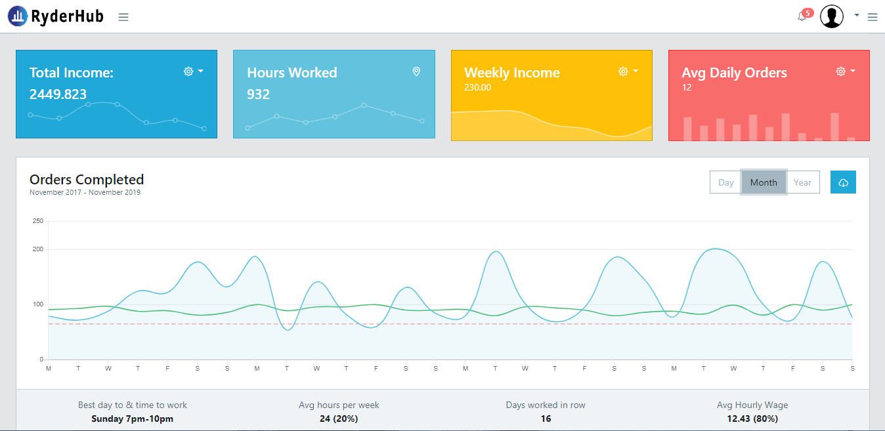
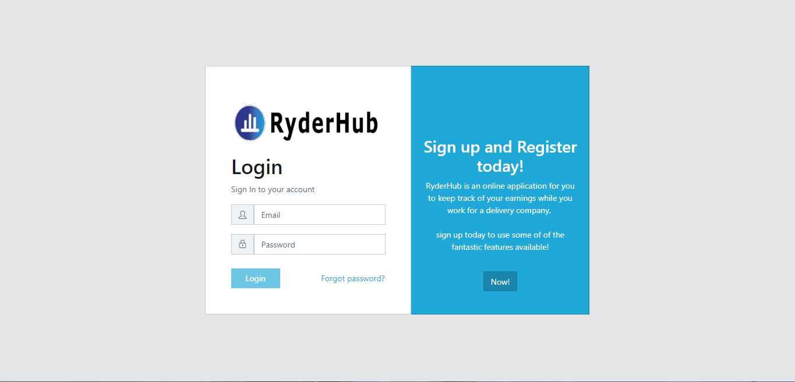
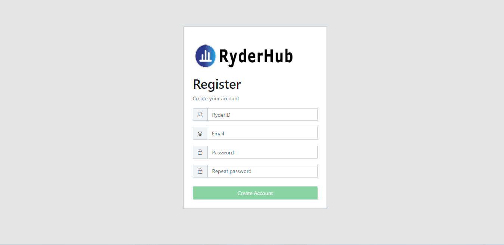
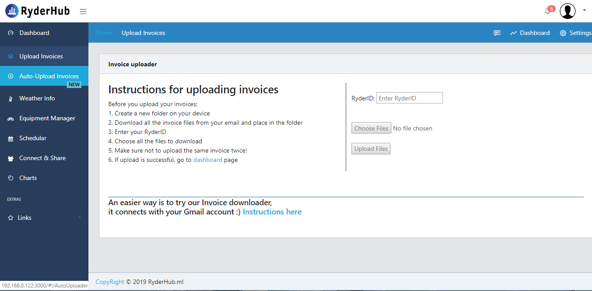
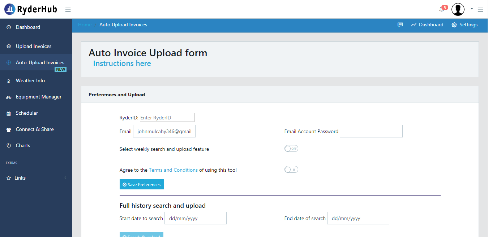

# RyderHub.ml

# RyderHub is an app for deliveroo ryders.

# Features include: 
 * payment monitoring application
 * Share and connect with other deliveroo ryders
 * upload invoice payments to analyis earnings
 * sync wih google schedule your work days
 * Equipment manager - track repairs and get service notifications
 * weather alerts
 

## Login Page

## Register page for new users

## Upload payment invoices

## Auto upload, Connect with Gmail

