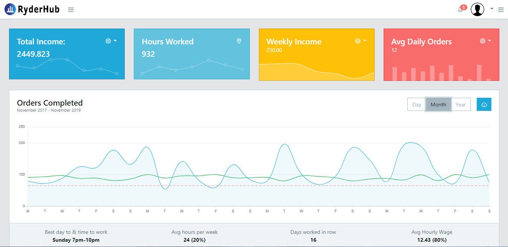
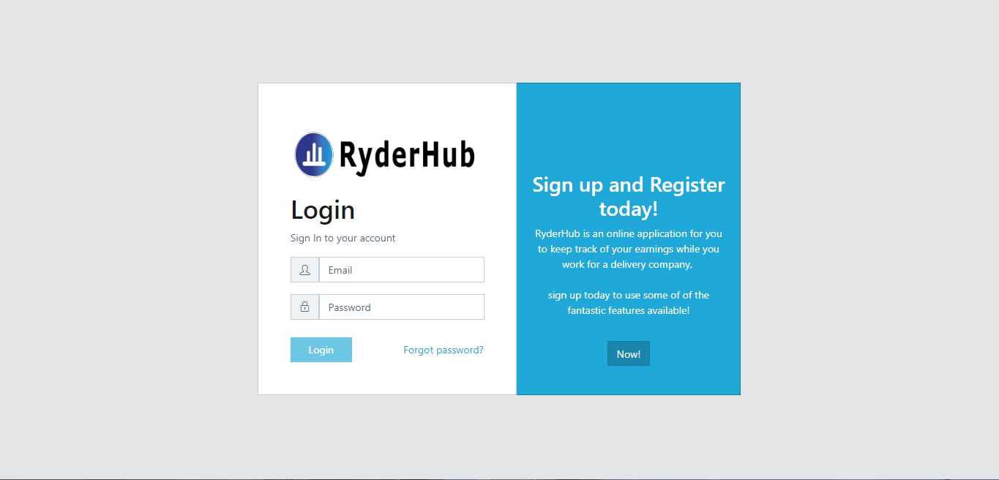
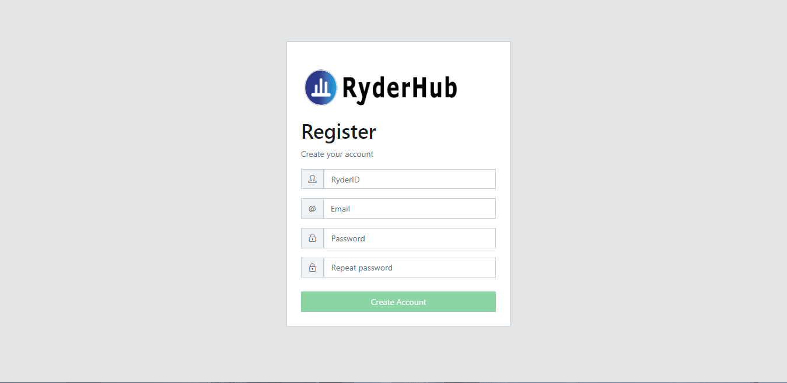
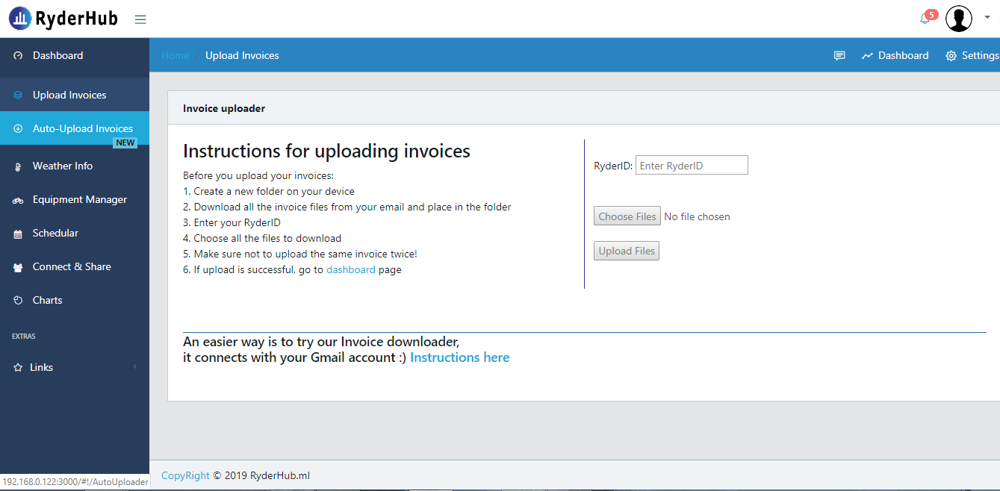
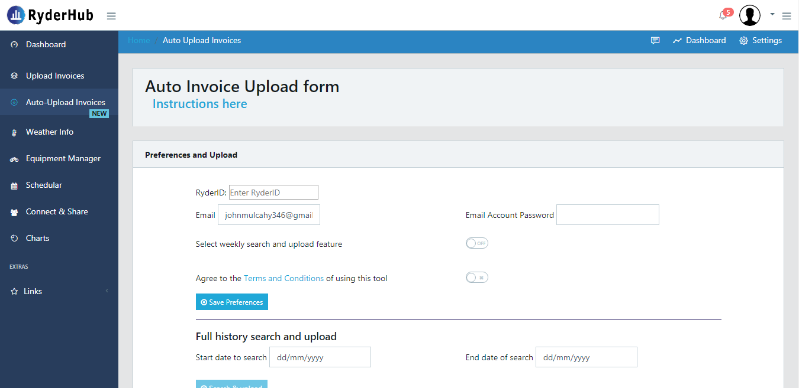
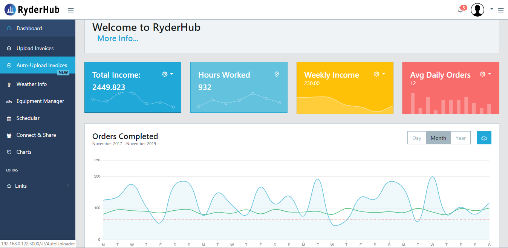

# RyderHub.ml

# RyderHub is an app for deliveroo ryders.

# Features include: 
 * Payment monitoring application
 * Share and connect with other deliveroo ryders
 * Upload invoice payments to analysis earnings
 * Sync wih google schedule your work days
 * Equipment manager - track repairs and get service notifications
 * Weather alerts
 

## Login Page

## Register page for new users

## Upload payment invoices

## Auto upload, Connect with Gmail

